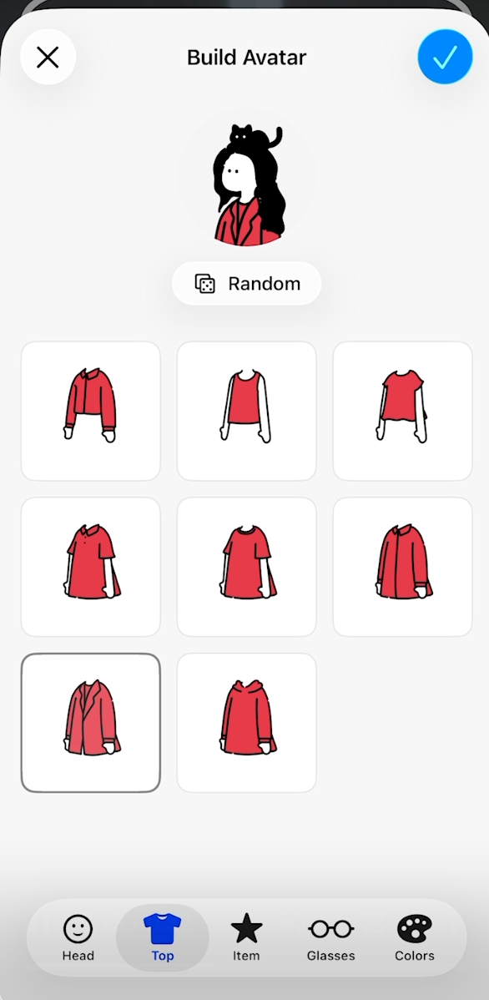

<p align="center">
  
</p>

# Humation

[](https://swift.org)
[](#)
[](https://swift.org/package-manager)
[](LICENSE)

A native Swift port of [Humation](https://github.com/endo-yusuke/humation) — a
deterministic, hand-drawn SVG avatar engine. Same seed → same avatar, rendered
**entirely with Core Graphics** (no `WKWebView`), pixel-faithful to the
reference renderer.

- **Deterministic**: a seed (e.g. a user id) maps to a fixed set of parts via
  FNV-1a, byte-identical to the TypeScript engine.
- **Native rendering**: an SVG subset is parsed to `CGPath` and composited to a
  `CGImage` / `UIImage`. No web view, no network.
- **Recolourable**: six colour slots (`background`, `stroke`, `hair`, `skin`,
  `clothes`, `bottom`) bound through `var(--hm-*)` references.
- **Bundled assets**: the full `humation-1` set (86 parts) ships as a package
  resource — nothing to download.
- **Platforms**: iOS 15+, macOS 12+, tvOS 15+, visionOS 1+. Swift 6, strict
  concurrency clean.

## How it works

Seed → FNV-1a hash → pick one part per slot (head / body / bottom / item /
glasses) → stack each part's SVG layers in `order` → bind the six colour slots →
crop and rasterise. Selection and hashing are byte-identical to the reference
engine, so the same seed yields the same avatar on web and native.

## Demo

https://github.com/user-attachments/assets/b12bb7cb-a09c-4923-be25-b234b6a5d35f

## Install

Swift Package Manager:

```swift
.package(url: "https://github.com/mana-am/humation-swift.git", from: "1.0.0")
```

## Usage

The `Humation` facade covers the common cases:

```swift
import Humation

// Optional: decode the bundled manifest off the main thread at launch.
Humation.prewarm()

// Seed → image, one line (UIImage on iOS/tvOS, NSImage on macOS, CGImage anywhere)
let image  = Humation.image(seed: user.id, pixels: 256)     // UIImage?
let cg     = Humation.cgImage(seed: user.id, pixels: 256)   // CGImage?

// SwiftUI
if let resolved = Humation.resolved(seed: user.id) {
    HumationAvatarView(resolved: resolved, size: 96)
}
```

Full control via the lower-level types:

```swift
let manifest = Humation.manifest!                 // bundled humation-1
var traits = HumationTraits()
traits.selections[.head] = manifest.parts(in: .head).first!.id
traits.colors[.hair] = "5B3A1E"
let resolved = traits.resolved(against: manifest)
let cg = HumationRenderer.render(resolved: resolved, manifest: manifest, pixels: 256)
```

### Custom / served asset packs

Load and validate a manifest authored outside the bundled set:

```swift
let pack = try Humation.manifest(contentsOf: url)        // or .manifest(from: data)
let issues = HumationValidator.validate(pack)            // [] = renderable
guard issues.isEmpty else { print(issues); return }
```

See `Sources/Humation/Example/HumationEditorExample.swift` for a self-contained
SwiftUI "build your avatar" editor (parts grid + colour swatches + randomise),
with no dependencies beyond SwiftUI + Humation.

## API at a glance

| Type | Role |
|---|---|
| `Humation` | Facade: `prewarm()`, `manifest`, seed → `image` / `cgImage` / `nsImage` / `resolved` |
| `HumationManifest` / `HumationManifestStore` | Asset manifest model + bundled `humation-1` loader |
| `HumationTraits` → `ResolvedHumation` | Input design (seed + overrides) resolved to concrete parts + colours |
| `HumationRenderer` | `render(…) → CGImage`, `image` / `nsImage`, `contentBounds(of:in:)` |
| `HumationAvatarView` | SwiftUI view — cached bitmap, cross-platform |
| `HumationValidator` | Lint a custom pack against the supported SVG subset |
| `HumationSelectionSlot` / `HumationColorSlot` | The 5 part slots / 6 colour slots |

## SVG subset

The bundled assets only use what the renderer implements, so authoring new parts
must stay within it:

- Path commands `M L H V C S Z` (absolute + relative). **No arcs `A`, no
  quadratics `Q`/`T`.**
- Primitives `circle` / `ellipse` / `rect` / `line` / `polygon` / `polyline`.
- Transforms `translate` / `scale` / `rotate` / `matrix` (stroke width is scaled
  with the coordinate system).
- `<style>` class rules, `fill-rule` / `clip-rule`, `clipPath`.
- Colours: `#hex`, `none`, named (`ivory`), and `var(--hm-SLOT, #fallback)` for
  recolourable regions.

## Credits

Engine, asset design, and the `humation-1` set are from
[endo-yusuke/humation](https://github.com/endo-yusuke/humation) (MIT). This is an
independent Swift/Core Graphics port. See `LICENSE`.
